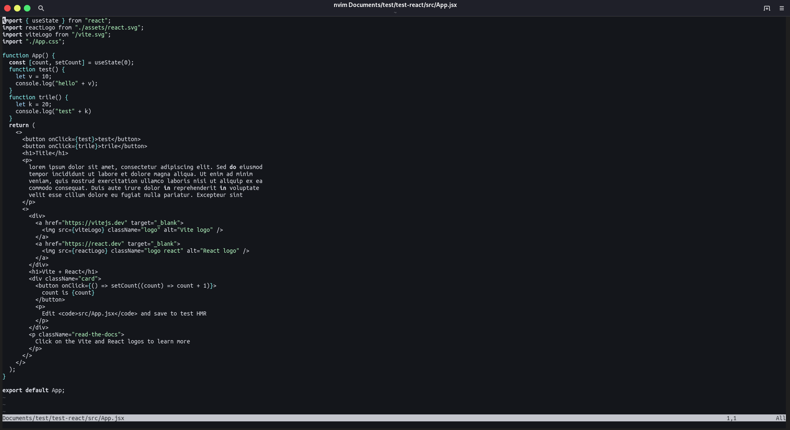
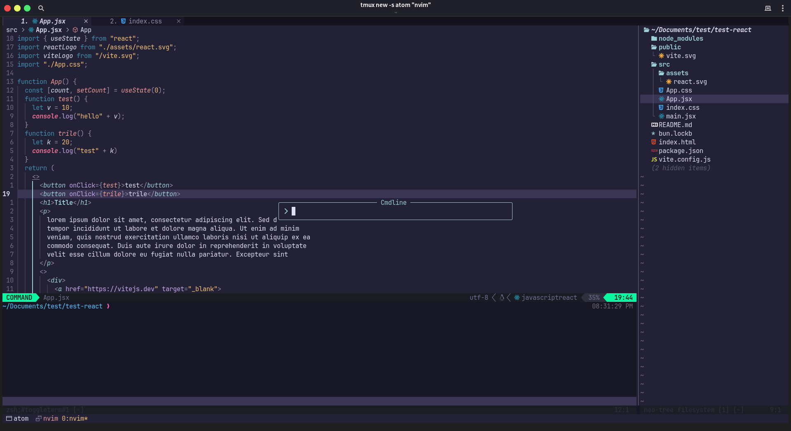

# My Neovim configuration

This is my personal Neovim configuration. It is a work in progress and I am constantly tweaking it to make it better.

## Installation

You can watch this playlist to setup your neoVim from scratch: [NeoVim from scratch](https://youtube.com/playlist?list=PLsz00TDipIffreIaUNk64KxTIkQaGguqn&si=qoPudYLfMp9C-hDq)

## My setup

_**Before image**_

_**After image**_

## Plugins

these are the plugins that I use:

| Plugin                                                                     | Description                   |
| -------------------------------------------------------------------------- | ----------------------------- |
| [lazy](https://www.lazyvim.org/installation)                               | lazy load plugins             |
| [neo-tree](https://github.com/nvim-neo-tree/neo-tree.nvim)                 | file explorer                 |
| [lualine](https://github.com/nvim-lualine/lualine.nvim)                    | status bar                    |
| [indent-blankline](https://github.com/lukas-reineke/indent-blankline.nvim) | indent lines                  |
| [everforest](https://github.com/sainnhe/everforest)                        | color scheme or theme         |
| [markdown-preview](https://github.com/iamcco/markdown-preview.nvim)        | markdown preview              |
| [mason](https://github.com/williamboman/mason-lspconfig.nvim)              | lsp installer                 |
| [nvim-lspconfig](https://github.com/neovim/nvim-lspconfig)                 | lsp config                    |
| [autopairs](https://github.com/windwp/nvim-autopairs)                      | auto pairs                    |
| [barbecue](https://github.com/utilyre/barbecue.nvim)                       | breadcrumb bar                |
| [codesnap](https://github.com/mistricky/codesnap.nvim)                     | code snapshot tool            |
| [nvim-treesitter](https://github.com/nvim-treesitter/nvim-treesitter)      | treesitter                    |
| [nvim-cmp](https://github.com/hrsh7th/nvim-cmp?tab=readme-ov-file)         | completion                    |
| [nvim-dap](https://github.com/mfussenegger/nvim-dap)                       | debugger                      |
| [nvim-dap-ui](https://github.com/rcarriga/nvim-dap-ui)                     | debugger ui                   |
| [none-ls](https://github.com/nvimtools/none-ls.nvim)                       | uses lsp for language support |
| [emmet-vim](https://github.com/mattn/emmet-vim)                            | emmet support                 |
| [telescope](https://github.com/nvim-telescope/telescope.nvim)              | fuzzy finder                  |
| [vim-commentary](https://github.com/tpope/vim-commentary)                  | comment lines                 |
| [copilot](https://github.com/github/copilot.vim)                           | github copilot support        |
| [gitsigns](https://github.com/lewis6991/gitsigns.nvim)                     | git signs                     |
| [vim-fugitive](https://github.com/tpope/vim-fugitive)                      | git commands                  |
| [lazygit](https://github.com/kdheepak/lazygit.nvim)                        | git ui                        |
| [ToggleTerm](https://github.com/akinsho/toggleterm.nvim)                   | Terminal                      |

> _**Note**_ : These are the plugins that I use, you can add or remove plugins as you like. and I didn't mention the configuration for each plugin, you can find it in the `plugins` directory.

## Keybindings

These are the keybindings that I use:

| Keybinding   | Description                               |
| ------------ | ----------------------------------------- |
| `Ctrl + p`   | fuzzy finder                              |
| `Ctrl + n`   | toggle file explorer                      |
| `Ctrl + t`   | toggle-terminal                           |
| `Ctrl + m`   | toggle markdown preview                   |
| `leader + g` | git ui                                    |
| `leader + b` | add break point                           |
| `leader + d` | debug code                                |
| `leader + m` | open meson                                |
| `leader + j` | open jupyter-lab                          |
| `gcc`        | (in normal mode) to comment and uncomment |
| `gc`         | (in visual mode) to comment and uncomment |

> _**Note**_ : These are the keybindings that I use, you can add or remove keybindings as you like. and I didn't mention the configuration for each keybinding, you can find it in the `plugins` directory.

> _**Note**_ : The `leader` key is the `space` key in my configuration.
